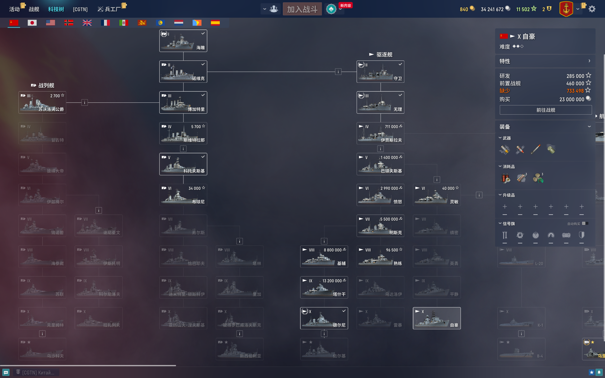
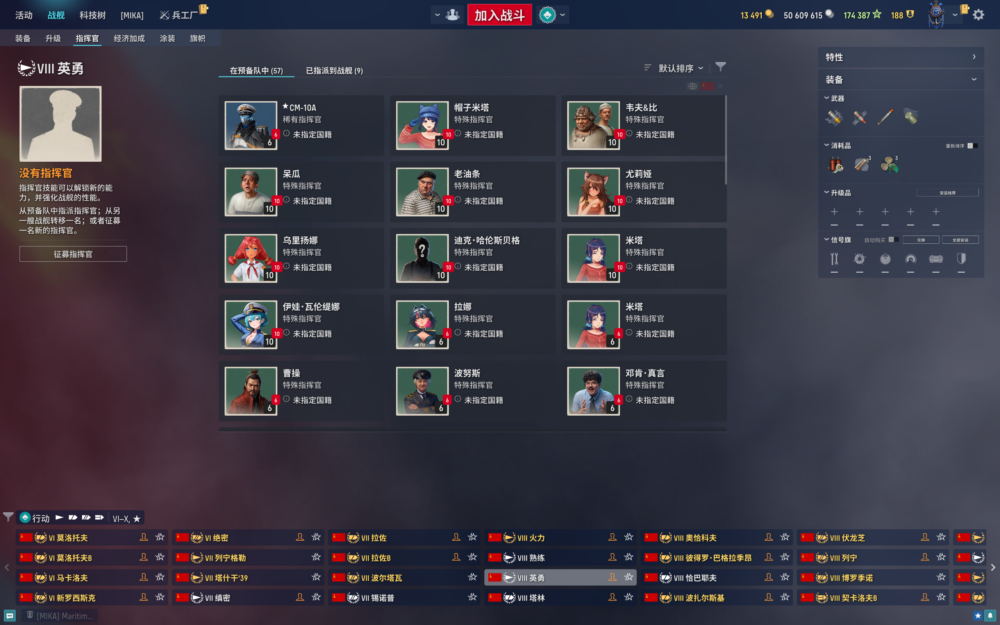
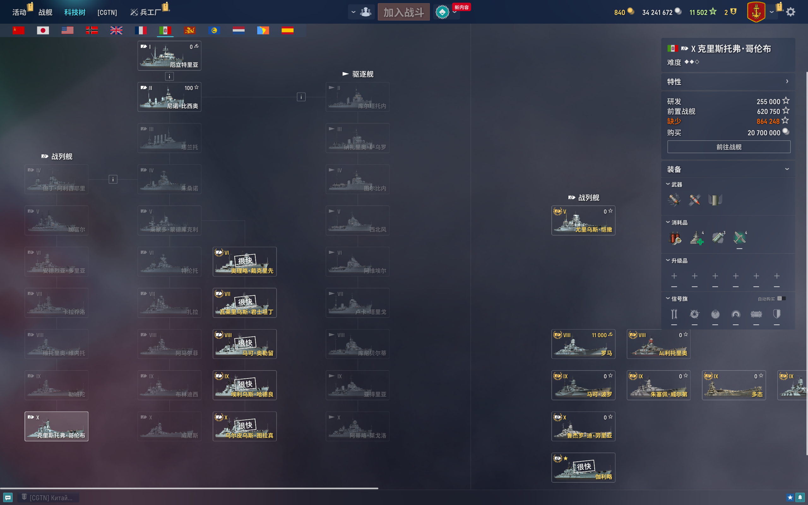
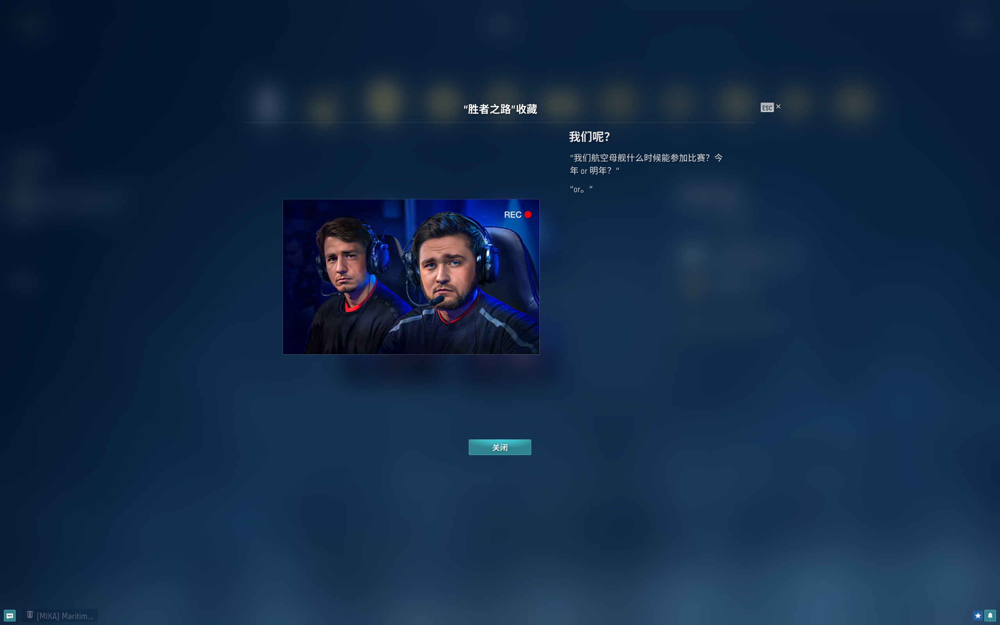

  

<h3>澪刻·Mir Korabley本地化</h3>

Looking for localizations for other languages? Check [this](#项目传送门).

## 如何使用

演示视频

介绍视频

### 安装

#### 方式1：在线安装器

1. 通过[蓝奏云](https://tapio.lanzn.com/b0nybehgb)或[GitHub Releases](https://github.com/LocalizedKorabli/L10nInstallerGUI/releases/latest)下载最新版汉化安装器的安装包；
2. 安装后运行，按照程序指示操作。

在线安装器运行图示

可选步骤

##### 模组

在线安装器可以自动将放置于`l10n_installer/mods/`目录的`mo`文件形式模组应用到即将被安装的汉化包。

###### 下载模组

[蓝奏云](https://tapio.lanzn.com/b0nxzso2b) | [GitHub](https://github.com/LocalizedKorabli/L10nModifications)

###### 安装模组

- 运行汉化安装器；
- 勾选“安装模组（汉化修改包）”；
- 点击“模组目录”；
- 将已下载的模组（.po、.mo、.json、.l10nmod文件，或包含这类文件的.zip压缩包）放入弹出的目录；
- 点击“安装汉化”。

#### 方式2：离线安装包

1. 通过[蓝奏云](https://tapio.lanzouu.com/b0nz5p18d)或[GitHub Releases](https://github.com/LocalizedKorabli/Korabli-LESTA-L10N/releases/latest)（.exe文件）下载最新版离线安装包；
2. 运行离线安装包，其会将汉化包自动安装到游戏路径下。

## 截图展示

   

   

## Q&A

- Q：为什么兵工厂、造船厂没有被翻译？

  A：这些页面实际上是由内置网页浏览器显示的，无法通过本地化文件翻译。
  
- Q：为什么游戏内文本又变回俄语了？

  A：每次版本更新时都会更换`bin`目录下的数字文件夹，重新安装汉化包即可。
  
- Q：为什么一些本该意译的船名被音译了？

  A：部分意译船名可能存在敏感内容，会给想要直播莱服游玩的汉化用户带来不便。若您需要意译版本的船名，请考虑使用`模组`（使用方法见本文-如何使用-安装-可选步骤-模组）。

## 贡献

[贡献指南](CONTRIBUTING.md)

## 背景

自2022年9月20日起，战舰世界独联体区玩家开始转移，一部分选择并入Wargaming直营欧服，另一部分则被分流到Lesta Games管理的新俄服（莱服）。

由于莱服主要面向俄罗斯和白俄罗斯玩家，其战舰世界客户端仅保留了俄语本地化文件。
想在莱服游玩的非俄语玩家一般会用从直营服提取的本地化文件来覆盖俄语文件。
这在最初是可行的，但随着版本更迭，莱服正在引入一些在直营服未曾出现的内容，
其文本显然不会被直营服的本地化文件所覆盖，从而不能正常显示，影响游玩体验。

于是，本项目应运而生。

## 项目特色

### 双线安装，准时送达

基于本团队率先开发的开源**自动在线安装器**与**离线安装包**，本项目的安装无缝兼顾所有用户的网络与环境需求：

- 基于链式启动**1**的**自动更新模式**允许用户以最少的操作和最小的等待时间完成每次汉化包更新

- 基于Inno Setup**2**的**离线安装包**自动检测Mir Korabley的安装目录，并在顷刻间完成所有安装流程

- 本团队严格遵循正式服/PT服版本上新时间推送在线汉化包，让用户免于等待，且尽最大可能杜绝版本错位

### 小步快跑，持续优化

在每个游戏版本周期内，本团队都会以**小步快跑**的方式，持续推出新版本汉化。这意味着：

- 漏洞无处遁形：开发人员在测试、游玩过程中一旦发现文本瑕疵，将即刻着手修改并推送更新

- 反馈必有回响：用户的每一条有效反馈都深刻影响着下一次迭代，本项目从不受制于游戏版本的更新节奏，修复与优化就在当下。

### 基于考据，尊重共识

本项目参考**历史资料、官方文献、玩家共识**，基于**一名一译、审慎合规**的原则进行翻译，致力于为玩家创造**清晰、直观、零误解**的游戏世界：

- 第一时间查阅历史资料与国内文献，初步确定接受度最高、最合理的译名

- 与NGABBS等社区接轨，最大限度地保证译名从进入社区到出现在游戏中这一过程的一致性

- 一些直营服时代的译名，或许不完全符合严格的翻译原则，但早已深入人心，成为了玩家共同记忆的一部分——本项目尽可能**保留**这类译名，尊重Mir Korabley原始玩家群体的阅读习惯与社区共识

### 力承众议，提供选择

本团队的**自动在线安装器**首创**汉化修改包**功能，允许用户通过多种格式的文件对汉化内容进行局部修改。对于社区内存在合理争议的战舰译名，本项目**从不一言堂**。相反，这些主流争议译名或被**采纳**，或被**制作成官方修改包**并存放于公共网盘。

### 无处不在，无微不至

不止步于Mir Korabley游戏本体汉化，本团队为提升玩家体验制作了以下衍生项目：

- [**Lesta Game Center多语言本地化**](https://github.com/LocalizedKorabli/LestaGameCenterL10n)
- [**Most汉化**](https://github.com/OpenKorabli/Korabli-Most-L10n-CHS)
- 包含多项界面/文本优化的**体验增强包****3**
- [**Mir Korabley中文语音补全**](https://tapio.lanzn.com/b0nyuflla)
- 融合WarHelios与Source Han Sans字形的[**SrcHelios字体**](https://tapio.lanzn.com/b0nyjuylc)及其面向有直播需求玩家的混淆版
- 面向兵工厂、军团、仓库等页面大部分静态文本的[战舰世界网页内容汉化](https://microsoftedge.microsoft.com/addons/detail/%E6%88%98%E8%88%B0%E4%B8%96%E7%95%8C%E8%8E%B1%E6%9C%8D%E7%BD%91%E9%A1%B5%E6%B1%89%E5%8C%96/fleemlkpeifpkiphpjabhpiomefikpho)
- [**战舰名拉丁化工具**](https://bbs.nga.cn/read.php?tid=44347524)

### 开源共进，拥抱社区

本项目采用CC BY-NC-SA 4.0许可证，允许且鼓励其他开发者合规修改/再分发。本团队与Mir Korabley开发人员、部分其他Mir Korabley非官方汉化组（如：[隐羽汉化](https://bbs.nga.cn/read.php?tid=44049188)）、兄弟游戏Mir Tankov非官方本地化人员或小组（负责汉化的[艾伦汉化](https://tanki.onlyax.com/)及负责英、德、波三语本地化的[LocalizedTanki](https://github.com/LocalizedTanki)）均建立了紧密良好的合作关系。本团队始终致力于推动游戏社区形成良好的协作氛围，我们愿与所有志同道合者一道，打破语言壁垒，共享游戏乐趣。

### 备注
#### 【1】链式启动
- 用户通过**自动在线安装器**生成的快捷方式，以小窗口的**自动更新模式**启动**自动在线安装器**，后者在检查汉化包版本（并在必要情况下更新之）后直接启动Lesta Game Center。
#### 【2】Inno Setup安装包构建框架
- **Inno Setup**是Jordan Russell与Martijn Laan以Delphi编程语言写就的开源安装包构建框架。其能够可靠地将软件部署到全球数百万台PC，自1997年推出以来，一直受到开发人员和各种规模组织的信赖。
#### 【3】体验增强包
- 体验增强包结合了NGA论坛用户制作的[输入法修复模组](https://bbs.nga.cn/read.php?tid=29102783)、基于Unbound2的界面优化模组，以及对Most模组站上其他Mir Korabley模组文本内容的汉化。体验增强包被内置在离线安装包中，并（可）于在线安装器中随汉化包一同安装
## 项目传送门

澪刻正面向多个语言、服务器类型制作本地化，
您可以通过点击以下表格中的链接快速访问相应的项目仓库。

| 语言\服务器类型 | 正式服 | PT服 |
|:------------:|:----------:|:--------:|
| 简体中文 | **本仓库** | [仓库地址](https://github.com/LocalizedKorabli/Korabli-LESTA-L10N-PublicTest) |
| 繁體中文 | [仓库地址](https://github.com/LocalizedKorabli/Korabli-L10n-CHT) | [仓库地址](https://github.com/LocalizedKorabli/Korabli-L10n-CHT-PublicTest) |
| English | [仓库地址](https://github.com/LocalizedKorabli/Korabli-LESTA-I18N) | [仓库地址](https://github.com/LocalizedKorabli/Korabli-LESTA-I18N-PublicTest) |

## 相关链接

[Gitee](https://gitee.com/nova-committee/korabli-LESTA-L10N)

[Korabli Forum发布页](https://forum.korabli.su/topic/161848-/)

[Bilibili教学视频](https://www.bilibili.com/video/BV1c4421D7Gh)